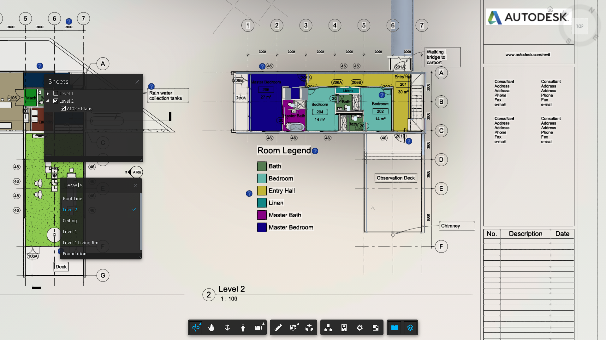
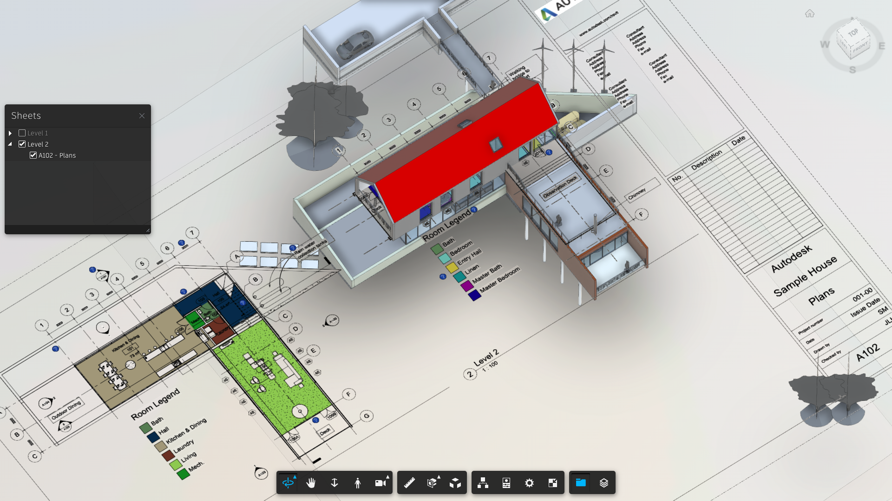

# Simple Viewer (Node.js)


[](https://nodejs.org)
[](https://www.npmjs.com/)
[](https://opensource.org/licenses/MIT)

[Autodesk Platform Services](https://aps.autodesk.com) application built by following
the [Simple Viewer](https://tutorials.autodesk.io/tutorials/simple-viewer/) tutorial
from https://tutorials.autodesk.io.

This sample is a revision of the [Simple Viewer](https://tutorials.autodesk.io/tutorials/simple-viewer/) tutorial from https://get-started.aps.autodesk.com/ demonstrating how to use hypermodeling ext in APS Viewer.

## Note for Revit model configuration

1. The `AecModelData` will be produced for models of Revit 2018 and later, see:
    - https://aps.autodesk.com/blog/consume-aec-data-which-are-model-derivative-api
    - https://aps.autodesk.com/blog/add-revit-levels-and-2d-minimap-your-3d

2. Floor plans must be placed in sheets and only available for the blew, see [here](https://knowledge.autodesk.com/support/bim-360/learn-explore/caas/CloudHelp/cloudhelp/ENU/BIM360D-Design-Collaboration/files/GUID-0A824636-51A3-4EDC-8152-8D42CFF5616E-html.html) for details.

    - 2D sheets with floor plan views, structural plan views, or reflected ceiling plan views. Other sheets with callout or area plan views are not supported currently.
    - Sheets with the [Crop View checkbox enabled](https://knowledge.autodesk.com/support/revit-products/learn-explore/caas/CloudHelp/cloudhelp/2020/ENU/Revit-DocumentPresent/files/GUID-8BEBCEF0-CE2C-4635-8C7C-9D03503C0B79-htm.html) in Revit.
    - Views without view breaks. Views containing view breaks or view splits are not supported currently.
    - The view placed in the sheets should not contain any of [Plan Regions](https://help.autodesk.com/view/RVT/2024/ENU/?guid=GUID-594B7B97-0D59-4B03-9544-E403BD03BE48).
      ```csharp
      var planRegion = new FilteredElementCollector(document).OfCategory(BuiltInCategory.OST_PlanRegion).ToList();

      planRegion.Any(r => r.OwnerViewId.Value() == planView.Id.Value());

      //Before 2024
      //planRegion.Any(r => r.OwnerViewId.IntegerValue == planView.Id.IntegerValue);
      ```

## Thumbnail





## Development

### Prerequisites

- [APS credentials](https://aps.autodesk.com/en/docs/oauth/v2/tutorials/create-app)
- [Node.js](https://nodejs.org) (Long Term Support version is recommended)
- Command-line terminal such as [PowerShell](https://learn.microsoft.com/en-us/powershell/scripting/overview)
or [bash](https://en.wikipedia.org/wiki/Bash_(Unix_shell)) (should already be available on your system)

> We recommend using [Visual Studio Code](https://code.visualstudio.com) which, among other benefits,
> provides an [integrated terminal](https://code.visualstudio.com/docs/terminal/basics) as well.

### Setup & Run

- Clone this repository: `git clone https://github.com/autodesk-platform-services/aps-simple-viewer-nodejs`
- Go to the project folder: `cd aps-simple-viewer-nodejs`
- Install Node.js dependencies: `npm install`
- Open the project folder in a code editor of your choice
- Create a _.env_ file in the project folder, and populate it with the snippet below,
replacing `<client-id>` and `<client-secret>` with your APS Client ID and Client Secret:

```bash
APS_CLIENT_ID="<client-id>"
APS_CLIENT_SECRET="<client-secret>"
```

- Run the application, either from your code editor, or by running `npm start` in terminal
- Open http://localhost:8080

> When using [Visual Studio Code](https://code.visualstudio.com), you can run & debug
> the application by pressing `F5`.

## Troubleshooting

Please contact us via https://aps.autodesk.com/en/support/get-help.

## License

This sample is licensed under the terms of the [MIT License](http://opensource.org/licenses/MIT).
Please see the [LICENSE](LICENSE) file for more details.

## Written by

Eason Kang [in/eason-kang-b4398492/](https://www.linkedin.com/in/eason-kang-b4398492), [Developer Advocacy and Support Team](http://aps.autodesk.com)